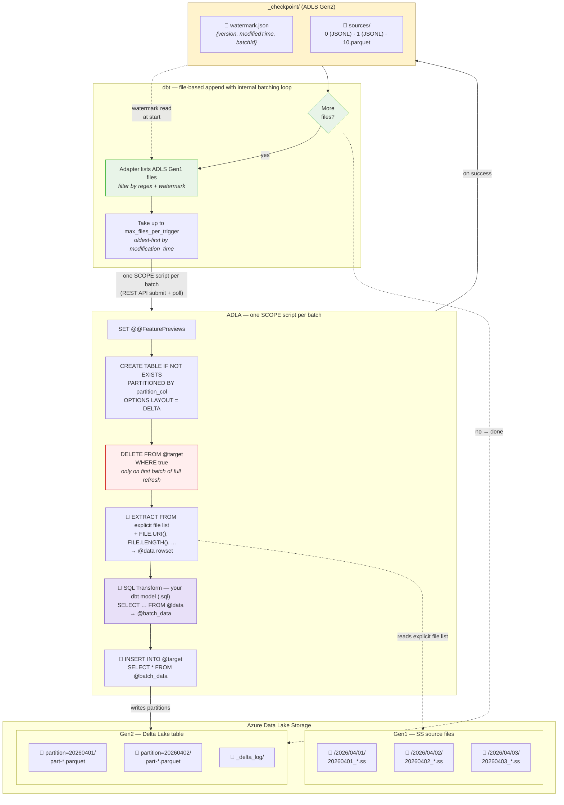

<!-- PROJECT LOGO -->
<p align="center">
  
  <h3 align="center">ADLA - dbt</h3>
  <p align="center">
    Incremental data transformation for ADLA using dbt to get data into Delta Lake tables.
    <br />
    <br />
    <a href="https://docs.getdbt.com/">dbt Docs</a>
    ·
    <a href="https://azure.microsoft.com/en-us/products/data-lake-analytics">Azure Data Lake Analytics docs</a>
    ·
    <a href="https://delta.io/">Delta Lake</a>
  </p>
</p>

---

## What is this?

This is an [opinionated](https://www.merriam-webster.com/dictionary/opinionated) [dbt adapter](https://docs.getdbt.com/docs/connect-adapters?version=1.12) that makes it easier to test and schedule ADLA via dbt CLI without requiring an external orchestrator (such as [Data Factory](https://learn.microsoft.com/en-us/azure/data-factory/introduction)) to get non-Delta Lake source data lightly-transformed with SQL and incrementally ingestied via ADLA compute into Delta Lake Tables using a quasi-SQL syntax.

The adapter handles performing non-SQL syntax generation at compile time in the dbt adapter using [dbt macros](https://docs.getdbt.com/docs/build/jinja-macros?version=1.12).

As a result of this conscious design decision, the adapter **does not** encourage working with non-SQL constructs such as pre-processing imperative directives like `#FOO`.

> In fact, in the future, the adapter can/will use [sqlglot](https://github.com/tobymao/sqlglot) to block non-SQL syntax in the model SQL like `#FOO`, the goal here is to keep the business logic as close to ANSI-SQL as possible for portability across engines. As a result of this, a tradeoff is the ADLA feature surface is limited in this dbt adapter to only support run-time syntax, not ADLA compile-time syntax such as `#FOO` or `#IFDEF` etc.

## Key features

- **Clean SQL models** — write `SELECT ... FROM @data`; macros generate `EXTRACT`, `INSERT INTO`
- **File-based incremental** — the adapter lists source files on ADLS Gen1, filters by watermark, and processes up to `max_files_per_trigger` per SCOPE job. Uses `append` strategy — dbt calls the macro once per `dbt run`, no date-range orchestration needed - this is very similar to Apache Spark [Microbatch based structured streaming](https://spark.apache.org/docs/latest/streaming/getting-started.html)
- **Watermark checkpoint** — progress is tracked in `_checkpoint/watermark.json` alongside `_delta_log/`. Re-runs automatically skip already-processed files; full refresh resets the checkpoint
- **Sources audit trail** — per-batch JSONL diffs record which files were processed. Configurable compaction (parquet snapshots) and retention keep the checkpoint directory bounded - similar once again to Spark structured streaming.
- **Virtual file metadata** — `source_file_uri`, `source_file_length`, `source_file_created`, `source_file_modified` columns map to `FILE.*()` functions, giving each row lineage back to its source file
- **Declarative table properties** — compression, checkpoint intervals via `scope_settings`

## How it works

SS files live on ADLS Gen1. The adapter lists files under each `source_roots` entry, filters by each regex in `source_patterns` (cross-product), deduplicates by path, and processes them in batches of up to `max_files_per_trigger`. Each batch becomes a single SCOPE job with an explicit file list in the `EXTRACT FROM` clause. After a successful job, the watermark advances, a sources record is written to `_checkpoint/`, and the next batch is discovered — repeating until all files are processed.

### How dbt picks which files to process

The adapter discovers unprocessed files using a watermark-based checkpoint stored at `_checkpoint/watermark.json` next to the Delta table's `_delta_log/`:

| Scenario                          | What runs                                                                               |
| --------------------------------- | --------------------------------------------------------------------------------------- |
| **First run** or `--full-refresh` | Checkpoint deleted → all matching files processed in batches of `max_files_per_trigger` |
| **Incremental run**               | Only files with `modification_time` after the watermark are processed                   |
| **No new files**                  | No-op — watermark stays the same                                                        |

The **safety buffer** (`safety_buffer_seconds`, default 30) skips files modified within the last N seconds to avoid reading partially-written files.

### Checkpoint lifecycle

After each successful SCOPE job:

1. **Watermark updated** — `_checkpoint/watermark.json` records `{version, modifiedTime, batchId}`
2. **Sources recorded** — a JSONL diff in `_checkpoint/sources/{batchId}` lists every file processed in that batch
3. **Compaction** — every `source_compaction_interval` batches, a parquet snapshot is written containing all history (latest snapshot + JSONL diffs since + current batch). All files persist on disk — **compaction never deletes anything**
4. **Retention** — `source_retention_files` caps the total number of files in `_checkpoint/sources/`, deleting the oldest first. This is the **only** mechanism that removes files

On **full refresh**, the checkpoint is deleted before processing begins. The adapter re-discovers all files and starts fresh at `batch_id=0`.

### What each SCOPE job does



On **full refresh**, every file is processed in batches. The `DELETE` step (red) only runs on the first batch — subsequent batches append. On **incremental**, only files newer than the watermark are processed — no `DELETE` step. The checkpoint (yellow) tracks progress so re-runs skip already-processed files automatically. The batching loop continues until all unprocessed files are consumed.

The scope jobs end up looking like this in ADLA:


## Install

```bash
curl -LsSf https://astral.sh/uv/install.sh | sh  # one-time install for uv
uv sync --extra dev                               # creates .venv and installs dbt-scope + dev deps
```

## Configure

All sensitive values live in `.env` (see `.env.example`). The profile references them via `env_var()`:

```yaml
# profiles.yml
my_project:
  target: dev
  outputs:
    dev:
      type: scope
      database: "{{ env_var('SCOPE_STORAGE_ACCOUNT') }}"
      schema: "{{ env_var('SCOPE_CONTAINER') }}"
      adla_account: "{{ env_var('SCOPE_ADLA_ACCOUNT') }}"
      storage_account: "{{ env_var('SCOPE_STORAGE_ACCOUNT') }}"
      container: "{{ env_var('SCOPE_CONTAINER') }}"
      delta_base_path: delta
      adls_gen1_account: "{{ env_var('SCOPE_ADLS_GEN1_ACCOUNT') }}"
      au: 100
      priority: 1
```

| dbt concept   | SCOPE concept                                             |
| ------------- | --------------------------------------------------------- |
| `database`    | Storage account name                                      |
| `schema`      | ADLS container                                            |
| `table`       | Full-refresh: `CREATE TABLE` + `INSERT INTO`              |
| `incremental` | File-based append: discover → process → checkpoint, looped until all files done |
| model SQL     | `SELECT` from `@data` (extracted SS rowset)               |

## Usage

### Full refresh

```sql
{{ config(
    materialized='table',
    delta_location='abfss://ctr@acct.dfs.core.windows.net/delta/my_table',
    source_roots=['/my/cosmos/path/to/MyStream'],
    source_patterns=['.*\\.ss$'],
    max_files_per_trigger=100,
    partition_by='event_year_date',
    scope_columns=[
        {'name': 'server_name', 'type': 'string'},
        {'name': 'source_file_uri', 'type': 'string'},
        {'name': 'event_year_date', 'type': 'string', 'extract': false}
    ],
    scope_settings={
        'microsoft.scope.compression': 'vorder:zstd#11',
        'delta.checkpointInterval': 5
    }
) }}

SELECT logical_server_name_DT_String AS server_name,
       source_file_uri,
       DateTime.UtcNow.ToString("yyyyMMdd") AS event_year_date
FROM @data
```

### Incremental (append) — file-based

```sql
{{ config(
    materialized='incremental',
    incremental_strategy='append',
    partition_by='event_year_date',
    delta_location='abfss://ctr@acct.dfs.core.windows.net/delta/my_model',
    source_roots=['/my/cosmos/path/to/MyStream'],
    source_patterns=['.*\\.ss$'],
    max_files_per_trigger=50,
    source_compaction_interval=10,
    source_retention_files=100,
    scope_columns=[
        {'name': 'server_name', 'type': 'string'},
        {'name': 'source_file_uri', 'type': 'string'},
        {'name': 'event_year_date', 'type': 'string', 'extract': false}
    ]
) }}

SELECT logical_server_name_DT_String AS server_name,
       source_file_uri,
       DateTime.UtcNow.ToString("yyyyMMdd") AS event_year_date
FROM @data
```

### Incremental — idempotent re-run

With file-based processing, idempotency is built in: the watermark ensures already-processed files are skipped. Re-running `dbt run` with no new source files is a no-op — the watermark and row count stay unchanged.

To fully reprocess from scratch, use `dbt run --full-refresh` — this deletes the checkpoint and reprocesses all files.

### Incremental with a filter

Models can include `WHERE` clauses — the adapter passes through your SQL as-is:

```sql
{{ config(
    materialized='incremental',
    incremental_strategy='append',
    partition_by=['event_year_date', 'edition'],
    delta_location='abfss://ctr@acct.dfs.core.windows.net/delta/my_filtered_model',
    source_roots=['/my/cosmos/path/to/MyStream'],
    source_patterns=['.*\\.ss$'],
    max_files_per_trigger=50,
    scope_columns=[
        {'name': 'server_name', 'type': 'string'},
        {'name': 'edition', 'type': 'string'},
        {'name': 'event_year_date', 'type': 'string', 'extract': false}
    ]
) }}

SELECT logical_server_name_DT_String AS server_name,
       edition,
       DateTime.UtcNow.ToString("yyyyMMdd") AS event_year_date
FROM @data
WHERE edition == "Standard"
```

### Incremental config reference

| Config                       | Default   | Description                                                                         |
| ---------------------------- | --------- | ----------------------------------------------------------------------------------- |
| `source_roots`               | `[]`      | List of ADLS Gen1 root paths to list source files from                              |
| `source_patterns`            | `[]`      | List of regexes; the adapter discovers files for each root × pattern combo          |
| `max_files_per_trigger`      | `50`      | Max files per SCOPE job. Larger = fewer jobs; smaller = faster feedback             |
| `safety_buffer_seconds`      | `30`      | Skip files modified within the last N seconds (avoids partial writes)               |
| `source_compaction_interval` | `10`      | Every N batches, write a parquet snapshot of all source history                     |
| `source_retention_files`     | `100`     | Max files in `_checkpoint/sources/` — oldest are deleted first                      |
| `partition_by`               | —         | Single column name or list of columns. Columns with `'extract': false` are computed |

`dbt retry` re-runs failed batches. `dbt run --full-refresh` resets the checkpoint and reprocesses all files.

## Contributing

See [CONTRIBUTING.md](CONTRIBUTING.md).
