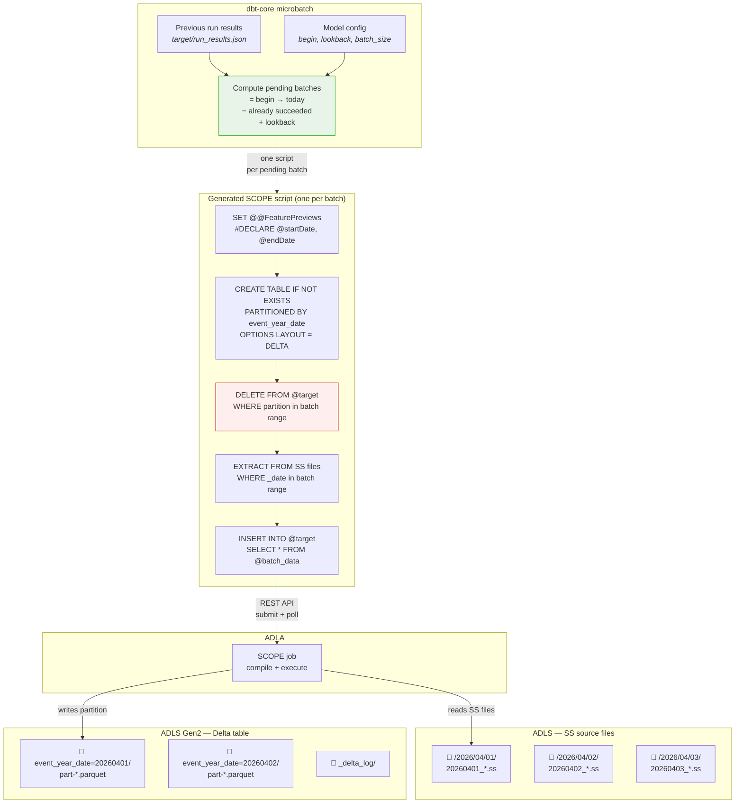

<!-- PROJECT LOGO -->
<p align="center">
  
  <h3 align="center">ADLA - dbt</h3>
  <p align="center">
    Incremental data transformation for ADLA using dbt.
    <br />
    <br />
    <a href="https://docs.getdbt.com/">dbt Docs</a>
    ·
    <a href="https://azure.microsoft.com/en-us/products/data-lake-analytics">Azure Data Lake Analytics docs</a>
  </p>
</p>

---

- **Clean SQL models** — write `SELECT ... FROM @data`; macros generate `#DECLARE`, `EXTRACT`, `INSERT INTO`
- **Microbatch incremental** — `DELETE+INSERT` per date partition, with dbt retry/backfill built in. `DELETE` is optional if the target can handle deduplication
- **Declarative table properties** — compression, checkpoint intervals via `scope_settings`

## How it works

SS files live on ADLS in date-partitioned directories. `dbt run` generates a SCOPE script per batch and submits each as an ADLA job. Each job reads only its date range (FileSet partition elimination), optionally deletes the target partition in Delta (for idempotent re-runs), and inserts into a Delta table on ADLS.

### How dbt picks which batches to run

dbt-core's microbatch framework determines which batches to process — **no query hits the Delta table** for a high watermark. Batch selection is driven entirely by dbt's own state:

| Scenario                          | What runs                                                                      |
| --------------------------------- | ------------------------------------------------------------------------------ |
| **First run** or `--full-refresh` | Every batch from `begin` (model config) through today                          |
| **Incremental run**               | Only new batches since the last successful run, plus `lookback` recent batches |
| **Manual backfill**               | Exactly the range you pass via `--event-time-start` / `--event-time-end`       |

dbt tracks which batches succeeded in its run-result artifacts (`target/run_results.json`). On the next `dbt run`, it skips already-succeeded batches and submits only new + lookback ones. The `lookback` parameter (default `1`) re-processes the most recent N batches to catch late-arriving SS files.

> Because SCOPE has no catalog, the adapter cannot detect whether the target table exists. Every generated script includes `CREATE TABLE IF NOT EXISTS`, making first runs safe without a separate existence check.

### What each SCOPE job does



On **full refresh**, every batch from `begin` to today runs and there is no `DELETE` step.
On **incremental**, only new + lookback batches run. The `DELETE` step (red) makes each batch idempotent — re-running the same date range replaces the partition rather than creating duplicates. Batch selection (green) is driven by dbt's artifact state, not by querying the Delta table.

The scope jobs end up looking like this in ADLA:


## Install

```powershell
pip install -e ".[dev]"    # Python 3.10+, dbt-core ~1.9
```

## Configure

All sensitive values live in `.env` (see `.env.example`). The profile references them via `env_var()`:

```yaml
# profiles.yml
my_project:
  target: dev
  outputs:
    dev:
      type: scope
      database: "{{ env_var('SCOPE_STORAGE_ACCOUNT') }}"
      schema: "{{ env_var('SCOPE_CONTAINER') }}"
      adla_account: "{{ env_var('SCOPE_ADLA_ACCOUNT') }}"
      storage_account: "{{ env_var('SCOPE_STORAGE_ACCOUNT') }}"
      container: "{{ env_var('SCOPE_CONTAINER') }}"
      delta_base_path: delta
      au: 100
      priority: 1
```

| dbt concept   | SCOPE concept                                |
| ------------- | -------------------------------------------- |
| `database`    | Storage account name                         |
| `schema`      | ADLS container                               |
| `table`       | Full-refresh: `CREATE TABLE` + `INSERT INTO` |
| `incremental` | Microbatch: `DELETE` partition + `INSERT`    |
| model SQL     | `SELECT` from `@data` (extracted SS rowset)  |

## Usage

### Full refresh

```sql
{{ config(
    materialized='table',
    delta_location='abfss://ctr@acct.dfs.core.windows.net/delta/my_table',
    ss_source_path='/my/cosmos/path/to/MyStream',
    partition_by='event_year_date',
    scope_columns=[
        {'name': 'server_name', 'type': 'string'},
        {'name': 'event_year_date', 'type': 'string'}
    ],
    scope_settings={
        'microsoft.scope.compression': 'vorder:zstd#11',
        'delta.checkpointInterval': 5
    }
) }}

SELECT logical_server_name_DT_String AS server_name,
       _date.ToString("yyyyMMdd") AS event_year_date
FROM @data
```

### Incremental (microbatch)

```sql
{{ config(
    materialized='incremental',
    incremental_strategy='microbatch',
    event_time='event_year_date',
    batch_size='day',
    begin='2026-04-01',
    lookback=1,
    partition_by='event_year_date',
    delta_location='abfss://ctr@acct.dfs.core.windows.net/delta/my_model',
    ss_source_path='/my/cosmos/path/to/MyStream',
    scope_columns=[
        {'name': 'server_name', 'type': 'string'},
        {'name': 'event_year_date', 'type': 'string'}
    ]
) }}

SELECT logical_server_name_DT_String AS server_name,
       _date.ToString("yyyyMMdd") AS event_year_date
FROM @data
```

`dbt retry` re-runs failed batches. `dbt run --event-time-start/end` backfills a range.

## Contributing

See [CONTRIBUTING.md](CONTRIBUTING.md).
<!-- PROJECT LOGO -->
<p align="center">
  
  <h3 align="center">ADLA - dbt</h3>
  <p align="center">
    Incremental data transformation for ADLA using dbt.
    <br />
    <br />
    <a href="https://docs.getdbt.com/">dbt Docs</a>
    ·
    <a href="https://azure.microsoft.com/en-us/products/data-lake-analytics">Azure Data Lake Analytics docs</a>
  </p>
</p>

---

- **Clean SQL models** — write `SELECT ... FROM @data`; macros generate `#DECLARE`, `EXTRACT`, `INSERT INTO`
- **Microbatch incremental** — `DELETE+INSERT` per date partition, with dbt retry/backfill built in. `DELETE` is optional if the target can handle deduplication
- **Declarative table properties** — compression, checkpoint intervals via `scope_settings`

## How it works

SS files live on ADLS in date-partitioned directories. `dbt run` generates a SCOPE script per batch and submits each as an ADLA job. Each job reads only its date range (FileSet partition elimination), optionally deletes the target partition in Delta (for idempotent re-runs), and inserts into a Delta table on ADLS.

### How dbt picks which batches to run

dbt-core's microbatch framework determines which batches to process — **no query hits the Delta table** for a high watermark. Batch selection is driven entirely by dbt's own state:

| Scenario                          | What runs                                                                      |
| --------------------------------- | ------------------------------------------------------------------------------ |
| **First run** or `--full-refresh` | Every batch from `begin` (model config) through today                          |
| **Incremental run**               | Only new batches since the last successful run, plus `lookback` recent batches |
| **Manual backfill**               | Exactly the range you pass via `--event-time-start` / `--event-time-end`       |

dbt tracks which batches succeeded in its run-result artifacts (`target/run_results.json`). On the next `dbt run`, it skips already-succeeded batches and submits only new + lookback ones. The `lookback` parameter (default `1`) re-processes the most recent N batches to catch late-arriving SS files.

> Because SCOPE has no catalog, the adapter cannot detect whether the target table exists. Every generated script includes `CREATE TABLE IF NOT EXISTS`, making first runs safe without a separate existence check.

### What each SCOPE job does


On **full refresh**, every batch from `begin` to today runs and there is no `DELETE` step.
On **incremental**, only new + lookback batches run. The `DELETE` step (red) makes each batch idempotent — re-running the same date range replaces the partition rather than creating duplicates. Batch selection (green) is driven by dbt's artifact state, not by querying the Delta table.

The scope jobs end up looking like this in ADLA:


## Install

```powershell
pip install -e ".[dev]"    # Python 3.10+, dbt-core ~1.9
```

## Configure

All sensitive values live in `.env` (see `.env.example`). The profile references them via `env_var()`:

```yaml
# profiles.yml
my_project:
  target: dev
  outputs:
    dev:
      type: scope
      database: "{{ env_var('SCOPE_STORAGE_ACCOUNT') }}"
      schema: "{{ env_var('SCOPE_CONTAINER') }}"
      adla_account: "{{ env_var('SCOPE_ADLA_ACCOUNT') }}"
      storage_account: "{{ env_var('SCOPE_STORAGE_ACCOUNT') }}"
      container: "{{ env_var('SCOPE_CONTAINER') }}"
      delta_base_path: delta
      au: 100
      priority: 1
```

| dbt concept   | SCOPE concept                                |
| ------------- | -------------------------------------------- |
| `database`    | Storage account name                         |
| `schema`      | ADLS container                               |
| `table`       | Full-refresh: `CREATE TABLE` + `INSERT INTO` |
| `incremental` | Microbatch: `DELETE` partition + `INSERT`    |
| model SQL     | `SELECT` from `@data` (extracted SS rowset)  |

## Usage

### Full refresh

```sql
{{ config(
    materialized='table',
    delta_location='abfss://ctr@acct.dfs.core.windows.net/delta/my_table',
    ss_source_path='/my/cosmos/path/to/MyStream',
    partition_by='event_year_date',
    scope_columns=[
        {'name': 'server_name', 'type': 'string'},
        {'name': 'event_year_date', 'type': 'string'}
    ],
    scope_settings={
        'microsoft.scope.compression': 'vorder:zstd#11',
        'delta.checkpointInterval': 5
    }
) }}

SELECT logical_server_name_DT_String AS server_name,
       _date.ToString("yyyyMMdd") AS event_year_date
FROM @data
```

### Incremental (microbatch)

```sql
{{ config(
    materialized='incremental',
    incremental_strategy='microbatch',
    event_time='event_year_date',
    batch_size='day',
    begin='2026-04-01',
    lookback=1,
    partition_by='event_year_date',
    delta_location='abfss://ctr@acct.dfs.core.windows.net/delta/my_model',
    ss_source_path='/my/cosmos/path/to/MyStream',
    scope_columns=[
        {'name': 'server_name', 'type': 'string'},
        {'name': 'event_year_date', 'type': 'string'}
    ]
) }}

SELECT logical_server_name_DT_String AS server_name,
       _date.ToString("yyyyMMdd") AS event_year_date
FROM @data
```

`dbt retry` re-runs failed batches. `dbt run --event-time-start/end` backfills a range.

## Contributing

See [CONTRIBUTING.md](CONTRIBUTING.md).
