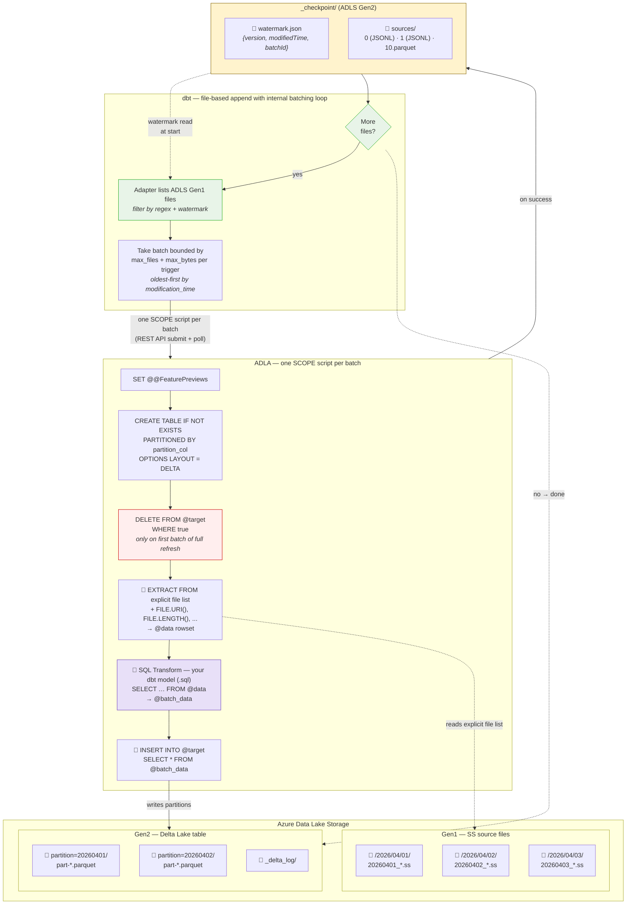

<!-- PROJECT LOGO -->
<p align="center">
  
  <h3 align="center">ADLA - dbt</h3>
  <p align="center">
    Incremental data transformation for ADLA using dbt to get data into Delta Lake tables.
    <br />
    <br />
    <a href="https://docs.getdbt.com/">dbt Docs</a>
    ·
    <a href="https://azure.microsoft.com/en-us/products/data-lake-analytics">Azure Data Lake Analytics docs</a>
    ·
    <a href="https://delta.io/">Delta Lake</a>
  </p>
</p>

---

## What is this?

This is an [opinionated](https://www.merriam-webster.com/dictionary/opinionated) [dbt adapter](https://docs.getdbt.com/docs/connect-adapters?version=1.12) that makes it easier to test and schedule ADLA via dbt CLI without requiring an external orchestrator (such as [Data Factory](https://learn.microsoft.com/en-us/azure/data-factory/introduction)) to get non-Delta Lake source data lightly-transformed with SQL and incrementally ingestied via ADLA compute into Delta Lake Tables using a quasi-SQL syntax.

The adapter handles performing non-SQL syntax generation at compile time in the dbt adapter using [dbt macros](https://docs.getdbt.com/docs/build/jinja-macros?version=1.12).

As a result of this conscious design decision, the adapter **does not** encourage working with non-SQL constructs such as pre-processing imperative directives like `#FOO`.

> In fact, in the future, the adapter can/will use [sqlglot](https://github.com/tobymao/sqlglot) to block non-SQL syntax in the model SQL like `#FOO`, the goal here is to keep the business logic as close to ANSI-SQL as possible for portability across engines. As a result of this, a tradeoff is the ADLA feature surface is limited in this dbt adapter to only support run-time syntax, not ADLA compile-time syntax such as `#FOO` or `#IFDEF` etc.

## Key features

- **Clean SQL models** — write `SELECT ... FROM @data`; macros generate `EXTRACT`, `INSERT INTO`
- **File-based incremental** — the adapter lists source files on ADLS Gen1, filters by watermark, and processes batches bounded by `max_files_per_trigger` and `max_bytes_per_trigger` per SCOPE job. Uses `append` strategy — dbt calls the macro once per `dbt run`, no date-range orchestration needed - this is very similar to Apache Spark [Microbatch based structured streaming](https://spark.apache.org/docs/latest/streaming/getting-started.html)
- **Watermark checkpoint** — progress is tracked in `_checkpoint/watermark.json` alongside `_delta_log/`. Re-runs automatically skip already-processed files; full refresh resets the checkpoint
- **Sources audit trail** — per-batch JSONL diffs record which files were processed. Configurable compaction (parquet snapshots) and retention keep the checkpoint directory bounded - similar once again to Spark structured streaming.
- **Virtual file metadata** — `source_file_uri`, `source_file_length`, `source_file_created`, `source_file_modified` columns map to `FILE.*()` functions, giving each row lineage back to its source file
- **Declarative table properties** — compression, checkpoint intervals via `scope_settings`

## How it works

SS files live on ADLS Gen1. The adapter lists files under each `source_roots` entry, filters by each regex in `source_patterns` (cross-product), deduplicates by path, estimates total data size per file (including SSv5/v6 `.du` sibling folders), and processes them in batches bounded by `max_files_per_trigger` and `max_bytes_per_trigger` (whichever limit is hit first). Each batch becomes a single SCOPE job with an explicit file list in the `EXTRACT FROM` clause. After a successful job, the watermark advances, a sources record is written to `_checkpoint/`, and the next batch is discovered — repeating until all files are processed.

### How dbt picks which files to process

The adapter discovers unprocessed files using a watermark-based checkpoint stored at `_checkpoint/watermark.json` next to the Delta table's `_delta_log/`:

| Scenario                          | What runs                                                                                                                   |
| --------------------------------- | --------------------------------------------------------------------------------------------------------------------------- |
| **First run** or `--full-refresh` | Checkpoint deleted → all matching files processed in batches bounded by `max_files_per_trigger` and `max_bytes_per_trigger` |
| **Incremental run**               | Only files with `modification_time` after the watermark are processed                                                       |
| **No new files**                  | No-op — watermark stays the same                                                                                            |

The **safety buffer** (`safety_buffer_seconds`, default 30) skips files modified within the last N seconds to avoid reading partially-written files.

### Checkpoint lifecycle

After each successful SCOPE job:

1. **Watermark updated** — `_checkpoint/watermark.json` records `{version, modifiedTime, batchId}`
2. **Sources recorded** — a JSONL diff in `_checkpoint/sources/{batchId}` lists every file processed in that batch
3. **Compaction** — every `source_compaction_interval` batches, a parquet snapshot is written containing all history (latest snapshot + JSONL diffs since + current batch). All files persist on disk — **compaction never deletes anything**
4. **Retention** — `source_retention_files` caps the total number of files in `_checkpoint/sources/`, deleting the oldest first. This is the **only** mechanism that removes files

On **full refresh**, the checkpoint is deleted before processing begins. The adapter re-discovers all files and starts fresh at `batch_id=0`.

### What each SCOPE job does



On **full refresh**, every file is processed in batches. The `DELETE` step (red) only runs on the first batch — subsequent batches append. On **incremental**, only files newer than the watermark are processed — no `DELETE` step. The checkpoint (yellow) tracks progress so re-runs skip already-processed files automatically. The batching loop continues until all unprocessed files are consumed.

The scope jobs end up looking like this in ADLA:


## Install

```bash
curl -LsSf https://astral.sh/uv/install.sh | sh  # one-time install for uv
uv sync --extra dev                               # creates .venv and installs dbt-scope + dev deps
```

## Configure

All sensitive values live in `.env` (see `.env.example`). The profile references them via `env_var()`:

```yaml
# profiles.yml
my_project:
  target: dev
  outputs:
    dev:
      type: scope
      database: "{{ env_var('SCOPE_STORAGE_ACCOUNT') }}"
      schema: "{{ env_var('SCOPE_CONTAINER') }}"
      adla_account: "{{ env_var('SCOPE_ADLA_ACCOUNT') }}"
      storage_account: "{{ env_var('SCOPE_STORAGE_ACCOUNT') }}"
      container: "{{ env_var('SCOPE_CONTAINER') }}"
      delta_base_path: delta
      adls_gen1_account: "{{ env_var('SCOPE_ADLS_GEN1_ACCOUNT') }}"
      au: 100
      priority: 1
```

### Profile reference

| Field                     | Default                                    | Description                                                        |
| ------------------------- | ------------------------------------------ | ------------------------------------------------------------------ |
| `adla_account`            | —                                          | ADLA account name                                                  |
| `storage_account`         | —                                          | ADLS Gen2 storage account name (also used as dbt `database`)       |
| `container`               | —                                          | ADLS Gen2 container (also used as dbt `schema`)                    |
| `delta_base_path`         | `"delta"`                                  | Base path under the container for Delta tables                     |
| `adls_gen1_account`       | `""`                                       | ADLS Gen1 account for source file listing                          |
| `au`                      | `100`                                      | Default ADLA Analytics Units (parallelism) per job                 |
| `priority`                | `1`                                        | Default ADLA job priority                                          |
| `poll_interval_seconds`   | `5`                                        | How often (seconds) to poll ADLA for job status                    |
| `job_timeout_seconds`     | `36000`                                    | Max seconds to wait for a SCOPE job before timing out              |
| `max_files_per_trigger`   | `50`                                       | Default max files per SCOPE job (overridable per-model)            |
| `max_bytes_per_trigger`   | `10737418240000` (10 TB)                   | Default max estimated bytes per batch (overridable per-model)      |
| `max_file_count_per_output_file_set` | `5000`                          | SCOPE `@@MaxFileCountPerOutputFileSet` (overridable per-model)     |
| `cancel_jobs_on_shutdown` | `true`                                     | Cancel in-flight ADLA jobs on SIGINT/SIGTERM                       |
| `wait_on_cancel_seconds`  | `30`                                       | Per-job wait for ADLA terminal state when cancelling on shutdown   |
| `http_timeout_seconds`    | `30`                                       | HTTP request timeout for ADLA REST API calls                       |
| `http_retries`            | `3`                                        | Number of HTTP retries for transient errors (429, 5xx)             |
| `scope_feature_previews`  | `"EnableDeltaTableDynamicInsert:on"`       | SCOPE feature preview flags (overridable per-model)                |

| dbt concept   | SCOPE concept                                                                   |
| ------------- | ------------------------------------------------------------------------------- |
| `database`    | Storage account name                                                            |
| `schema`      | ADLS container                                                                  |
| `table`       | Full-refresh: `CREATE TABLE` + `INSERT INTO`                                    |
| `incremental` | File-based append: discover → process → checkpoint, looped until all files done |
| model SQL     | `SELECT` from `@data` (extracted SS rowset)                                     |

## Usage

### Full refresh

```sql
{{ config(
    materialized='table',
    delta_location='abfss://ctr@acct.dfs.core.windows.net/delta/my_table',
    source_roots=['/my/cosmos/path/to/MyStream'],
    source_patterns=['.*\\.ss$'],
    max_files_per_trigger=100,
    max_bytes_per_trigger=10737418240000,  -- 10 TB
    partition_by='event_year_date',
    delta_table_columns=[
        {'name': 'server_name', 'type': 'string'},
        {'name': 'source_file_uri', 'type': 'string'},
        {'name': 'event_year_date', 'type': 'string'}
    ],
    extract_columns=[
        {'name': 'logical_server_name_DT_String', 'type': 'string'},
        {'name': 'source_file_uri', 'type': 'string'}
    ],
    scope_settings={
        'microsoft.scope.compression': 'vorder:zstd#11',
        'delta.checkpointInterval': 5
    }
) }}

SELECT logical_server_name_DT_String AS server_name,
       source_file_uri,
       DateTime.UtcNow.ToString("yyyyMMdd") AS event_year_date
FROM @data
```

### Incremental (append) — file-based

```sql
{{ config(
    materialized='incremental',
    incremental_strategy='append',
    partition_by='event_year_date',
    delta_location='abfss://ctr@acct.dfs.core.windows.net/delta/my_model',
    source_roots=['/my/cosmos/path/to/MyStream'],
    source_patterns=['.*\\.ss$'],
    max_files_per_trigger=50,
    source_compaction_interval=10,
    source_retention_files=100,
    delta_table_columns=[
        {'name': 'server_name', 'type': 'string'},
        {'name': 'source_file_uri', 'type': 'string'},
        {'name': 'event_year_date', 'type': 'string'}
    ],
    extract_columns=[
        {'name': 'logical_server_name_DT_String', 'type': 'string'},
        {'name': 'source_file_uri', 'type': 'string'}
    ]
) }}

SELECT logical_server_name_DT_String AS server_name,
       source_file_uri,
       DateTime.UtcNow.ToString("yyyyMMdd") AS event_year_date
FROM @data
```

### Incremental — idempotent re-run

With file-based processing, idempotency is built in: the watermark ensures already-processed files are skipped. Re-running `dbt run` with no new source files is a no-op — the watermark and row count stay unchanged.

To fully reprocess from scratch, use `dbt run --full-refresh` — this deletes the checkpoint and reprocesses all files.

### Incremental with a filter

Models can include `WHERE` clauses — the adapter passes through your SQL as-is:

```sql
{{ config(
    materialized='incremental',
    incremental_strategy='append',
    partition_by=['event_year_date', 'edition'],
    delta_location='abfss://ctr@acct.dfs.core.windows.net/delta/my_filtered_model',
    source_roots=['/my/cosmos/path/to/MyStream'],
    source_patterns=['.*\\.ss$'],
    max_files_per_trigger=50,
    delta_table_columns=[
        {'name': 'server_name', 'type': 'string'},
        {'name': 'edition', 'type': 'string'},
        {'name': 'event_year_date', 'type': 'string'}
    ],
    extract_columns=[
        {'name': 'logical_server_name_DT_String', 'type': 'string'},
        {'name': 'edition', 'type': 'string'}
    ]
) }}

SELECT logical_server_name_DT_String AS server_name,
       edition,
       DateTime.UtcNow.ToString("yyyyMMdd") AS event_year_date
FROM @data
WHERE edition == "Standard"
```

### Model config reference

| Config                       | Default                                | Description                                                                                                                                                                            |
| ---------------------------- | -------------------------------------- | -------------------------------------------------------------------------------------------------------------------------------------------------------------------------------------- |
| `delta_location`             | `""`                                   | ABFSS path to the Delta table (e.g. `abfss://ctr@acct.dfs.core.windows.net/delta/my_table`)                                                                                           |
| `source_roots`               | `[]`                                   | List of ADLS Gen1 root paths to list source files from                                                                                                                                 |
| `source_patterns`            | `['.*\\.ss$']`                         | List of regexes; the adapter discovers files for each root × pattern combo                                                                                                             |
| `max_files_per_trigger`      | from profile (`50`)                    | Max files per SCOPE job. Larger = fewer jobs; smaller = faster feedback                                                                                                                |
| `max_bytes_per_trigger`      | from profile (`10737418240000`, 10 TB) | Max estimated bytes per batch. Works alongside `max_files_per_trigger` — whichever limit is hit first stops the batch. Estimates account for SSv5/v6 `.du` sibling folders (see below) |
| `safety_buffer_seconds`      | `30`                                   | Skip files modified within the last N seconds (avoids partial writes)                                                                                                                  |
| `source_compaction_interval` | `10`                                   | Every N batches, write a parquet snapshot of all source history                                                                                                                        |
| `source_retention_files`     | `100`                                  | Max files in `_checkpoint/sources/` — oldest are deleted first                                                                                                                         |
| `starting_timestamp`         | —                                      | ISO 8601 timestamp (e.g. `2026-01-01T00:00:00+00:00`); only process files modified after this time when no watermark exists                                                            |
| `delta_table_columns`        | `[]`                                   | Delta table schema (CREATE TABLE). List of `{name, type}` dicts                                                                                                                        |
| `extract_columns`            | `[]`                                   | Source file columns (EXTRACT). List of `{name, type}` dicts                                                                                                                            |
| `partition_by`               | —                                      | Single column name or list of columns for Delta table partitioning                                                                                                                     |
| `scope_settings`             | `{}`                                   | Delta table properties passed to `ALTER TABLE SET TBLPROPERTIES` (e.g. compression, checkpoint intervals)                                                                              |
| `au`                         | from profile                           | Per-model ADLA Analytics Units (parallelism) override                                                                                                                                  |
| `priority`                   | from profile                           | Per-model ADLA job priority override                                                                                                                                                   |
| `job_timeout_seconds`        | from profile                           | Per-model job timeout override (seconds)                                                                                                                                               |
| `job_tag`                    | model alias                            | Custom identifier for ADLA job naming and orphan cancellation scoping. Use to isolate parallel runs of the same model (e.g. in CI)                                                     |
| `scope_feature_previews`     | `"EnableDeltaTableDynamicInsert:on"`   | Per-model SCOPE feature preview flags override                                                                                                                                         |

`dbt retry` re-runs failed batches. `dbt run --full-refresh` resets the checkpoint and reprocesses all files.

### Byte estimation for SSv5/v6 structured streams

When `max_bytes_per_trigger` is in effect, the adapter estimates the true data size of each `.ss` file before batching. This matters because Structured Stream versions differ in storage layout:

| Version     | Layout                                                   | Size estimation                             |
| ----------- | -------------------------------------------------------- | ------------------------------------------- |
| **SSv3/v4** | Single `.ss` file — all data inline                      | File size = data size                       |
| **SSv5/v6** | `.ss` manifest (small) + sibling folder with `.du` files | Manifest size + sum of all `.du` file sizes |

The adapter detects the version by checking if a sibling folder exists (e.g., `MyData.ss` → `MyData/`). For SSv5/v6, it recursively lists the sibling folder — including delta update subdirectories — and sums all file sizes. No binary parsing is involved; detection is purely filesystem-based.

The debug log includes `estimatedBytes` and `contributingFiles` columns in the batch metadata table so you can see the estimated size and which `.du` files contribute to each `.ss` file.

### Streaming / Continuous Processing

By default, dbt-scope uses **`available_now`** semantics: each `dbt run` discovers all pending files, processes them in batches, then exits. This works well when all models process at similar speeds, but fast models are "penalized" — they can't process newly arrived files until the slowest model finishes.

The **`processing_time`** trigger mode solves this by running each model in a continuous loop: discover files → process batches → sleep → repeat. Each model loops independently, so fast models aren't blocked by slow ones.

#### Configuration

Add the `trigger` config to your model's `config()` block:

```sql
-- Default (current behavior): process all available files, then exit
{{ config(
    materialized='incremental',
    incremental_strategy='append',
    trigger={'type': 'available_now'},
    ...
) }}

-- Continuous processing: loop forever, sleeping 30s between cycles
{{ config(
    materialized='incremental',
    incremental_strategy='append',
    trigger={'type': 'processing_time', 'interval': '30 seconds'},
    source_roots=['/shares/...'],
    ...
) }}

-- With max_cycles for controlled shutdown (e.g., testing or deployments)
{{ config(
    materialized='incremental',
    incremental_strategy='append',
    trigger={'type': 'processing_time', 'interval': '10 seconds', 'max_cycles': 100},
    ...
) }}
```

#### Trigger options

| Option       | Type   | Required                    | Description                                                     |
| ------------ | ------ | --------------------------- | --------------------------------------------------------------- |
| `type`       | string | No (default: `available_now`) | `available_now` or `processing_time`                           |
| `interval`   | string | Yes (for `processing_time`)  | Sleep duration between cycles: `'10 seconds'`, `'30s'`, `'5m'` |
| `max_cycles` | int    | No (default: infinite)       | Maximum number of cycles before exiting                         |

#### Behavior

- **`available_now`**: Current behavior, unchanged. Discover all files → process in batches → exit.
- **`processing_time`**: Each cycle discovers new files, processes all batches, then sleeps for `interval`. If no files are found, the model logs a message and sleeps. The loop continues until `max_cycles` is reached or a shutdown signal is received.

#### Timeout

`processing_time` models automatically get a 30-day timeout (2,592,000 seconds) so `dbt run` doesn't kill them. You can override this with `job_timeout_seconds` in the model config.

#### Graceful shutdown

Send `SIGTERM` or `SIGINT` (Ctrl+C) to the dbt process. The adapter finishes the current SCOPE job, updates the checkpoint, then exits cleanly. All `processing_time` models respond to the same signal.

> **Note:** `processing_time` is only supported for `incremental` materializations.

## Graceful shutdown of ADLA jobs

When the dbt process receives `SIGINT` (Ctrl+C) or `SIGTERM`, the adapter:

1. Sets a shared shutdown flag so every in-flight `submit_and_wait` loop self-cancels its own SCOPE job.
2. Snapshots the process-wide registry of in-flight ADLA jobs and fans out parallel `CancelJob` REST calls — one worker per job, bounded at 32 threads.
3. **Waits for each cancelled job to reach a terminal `Ended` state** (typically a few seconds in ADLA) up to `wait_on_cancel_seconds` per job. Since cancels run in parallel, total wall-clock is `~wait_on_cancel_seconds` regardless of job count.

This is on by default. To opt out (e.g. in a CI environment where you'd rather let jobs run to completion):

```yaml
# profiles.yml
outputs:
  dev:
    type: scope
    cancel_jobs_on_shutdown: false
```

To tune how long the adapter blocks waiting for ADLA to confirm each cancel:

```yaml
outputs:
  dev:
    type: scope
    wait_on_cancel_seconds: 60  # default 30
```

**Caveats:**

- `SIGKILL` is uncatchable at the OS level — no Python handler can run. The existing `cancel_orphaned_jobs` cleanup (runs at the start of every new `dbt run` per model) is the safety net for that case: orphaned jobs from previous runs are cancelled before submitting a new one.
- On Windows, `SIGTERM` is not delivered the same way as on POSIX; `SIGINT` (Ctrl+C) works.
- Only jobs submitted by the **current** Python process are tracked — orphans from earlier `dbt run` invocations are handled by `cancel_orphaned_jobs`, not by this shutdown hook.

## Contributing

See [CONTRIBUTING.md](CONTRIBUTING.md).
