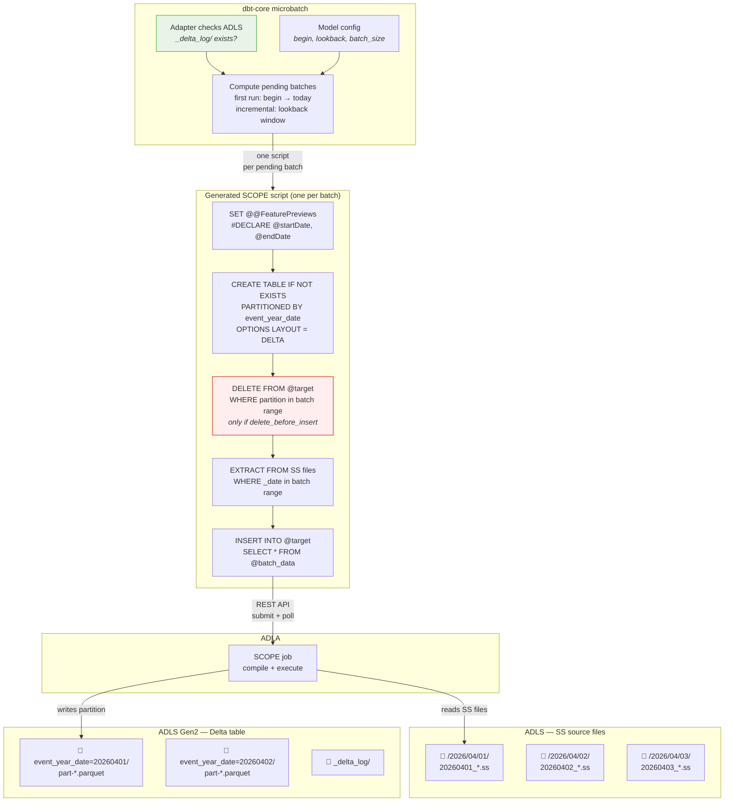
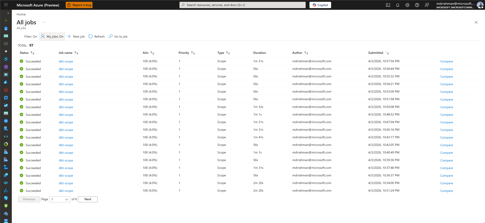
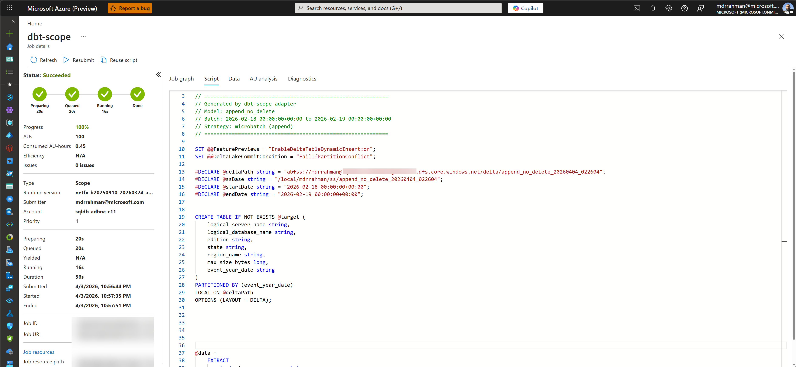

<!-- PROJECT LOGO -->
<p align="center">
  
  <h3 align="center">ADLA - dbt</h3>
  <p align="center">
    Incremental data transformation for ADLA using dbt.
    <br />
    <br />
    <a href="https://docs.getdbt.com/">dbt Docs</a>
    ·
    <a href="https://azure.microsoft.com/en-us/products/data-lake-analytics">Azure Data Lake Analytics docs</a>
  </p>
</p>

---

- **Clean SQL models** — write `SELECT ... FROM @data`; macros generate `#DECLARE`, `EXTRACT`, `INSERT INTO`
- **Microbatch incremental** — append-only by default; opt into idempotent `DELETE+INSERT` per partition with `delete_before_insert: true`. dbt retry/backfill built in
- **Batch bin-packing** — `days_per_batch` groups multiple days into a single SCOPE job to reduce ADLA overhead
- **High-watermark skip** — queries `MAX(partition_col)` from Delta via DuckDB and skips already-processed batches
- **Smart WHERE injection** — models with an existing `WHERE` clause get date filters merged with `AND`, not duplicated
- **Declarative table properties** — compression, checkpoint intervals via `scope_settings`

## How it works

SS files live on ADLS in date-partitioned directories. `dbt run` generates a SCOPE script per batch and submits each as an ADLA job. Each job reads only its date range (FileSet partition elimination), optionally deletes the target partition in Delta (when `delete_before_insert: true`), and inserts into a Delta table on ADLS.

### How dbt picks which batches to run

The adapter detects existing Delta tables by checking ADLS for `_delta_log/` directories. This tells dbt-core whether a model is running for the first time or incrementally:

| Scenario                           | What runs                                                                |
| ---------------------------------- | ------------------------------------------------------------------------ |
| **First run** or `--full-refresh`  | Every batch from `begin` (model config) through today                    |
| **Incremental run** (table exists) | Only the `lookback` most recent batches (default: yesterday + today)     |
| **Manual backfill**                | Exactly the range you pass via `--event-time-start` / `--event-time-end` |

The `lookback` parameter (default `1`) controls how many recent batches to reprocess on each incremental run, catching late-arriving SS files. For gap recovery (e.g. backfilling a missed week), use the CLI flags.

**High-watermark skip** — on each incremental run the adapter queries `MAX(partition_col)` from the Delta transaction log via DuckDB (no ADLA compute). Batches whose partition value is ≤ the high watermark are emitted as no-ops, avoiding redundant SCOPE jobs. The result is cached once per `dbt run` invocation.

### What each SCOPE job does



On **full refresh**, every batch from `begin` to today runs and there is no `DELETE` step.
On **incremental**, only the lookback window runs. The `DELETE` step (red) is **opt-in** via `delete_before_insert: true` — when enabled, re-running the same date range replaces the partition rather than creating duplicates. When omitted (default), batches are append-only. Table detection (green) checks ADLS for `_delta_log/` to determine if the model should run incrementally. Batches already present in Delta (per the high-watermark check) are skipped automatically.

The scope jobs end up looking like this in ADLA:





## Install

```powershell
winget install -e --id Astral-sh.uv  # one-time install for uv on Windows
uv sync --extra dev                  # creates .venv and installs dbt-scope + dev deps
```

## Configure

All sensitive values live in `.env` (see `.env.example`). The profile references them via `env_var()`:

```yaml
# profiles.yml
my_project:
  target: dev
  outputs:
    dev:
      type: scope
      database: "{{ env_var('SCOPE_STORAGE_ACCOUNT') }}"
      schema: "{{ env_var('SCOPE_CONTAINER') }}"
      adla_account: "{{ env_var('SCOPE_ADLA_ACCOUNT') }}"
      storage_account: "{{ env_var('SCOPE_STORAGE_ACCOUNT') }}"
      container: "{{ env_var('SCOPE_CONTAINER') }}"
      delta_base_path: delta
      au: 100
      priority: 1
```

| dbt concept   | SCOPE concept                                |
| ------------- | -------------------------------------------- |
| `database`    | Storage account name                         |
| `schema`      | ADLS container                               |
| `table`       | Full-refresh: `CREATE TABLE` + `INSERT INTO` |
| `incremental` | Microbatch: `INSERT` (append); opt-in `DELETE+INSERT` via `delete_before_insert` |
| model SQL     | `SELECT` from `@data` (extracted SS rowset)  |

## Usage

### Full refresh

```sql
{{ config(
    materialized='table',
    delta_location='abfss://ctr@acct.dfs.core.windows.net/delta/my_table',
    ss_source_path='/my/cosmos/path/to/MyStream',
    partition_by='event_year_date',
    scope_columns=[
        {'name': 'server_name', 'type': 'string'},
        {'name': 'event_year_date', 'type': 'string'}
    ],
    scope_settings={
        'microsoft.scope.compression': 'vorder:zstd#11',
        'delta.checkpointInterval': 5
    }
) }}

SELECT logical_server_name_DT_String AS server_name,
       _date.ToString("yyyyMMdd") AS event_year_date
FROM @data
```

### Incremental (microbatch) — append-only

```sql
{{ config(
    materialized='incremental',
    incremental_strategy='microbatch',
    event_time='event_year_date',
    batch_size='day',
    begin='2026-04-01',
    lookback=1,
    partition_by='event_year_date',
    delta_location='abfss://ctr@acct.dfs.core.windows.net/delta/my_model',
    ss_source_path='/my/cosmos/path/to/MyStream',
    days_per_batch=15,
    scope_columns=[
        {'name': 'server_name', 'type': 'string'},
        {'name': 'event_year_date', 'type': 'string'}
    ]
) }}

SELECT logical_server_name_DT_String AS server_name,
       _date.ToString("yyyyMMdd") AS event_year_date
FROM @data
```

### Incremental (microbatch) — idempotent delete+insert

Add `delete_before_insert: true` to DELETE the partition range before INSERT, making re-runs safe against duplicates:

```sql
{{ config(
    materialized='incremental',
    incremental_strategy='microbatch',
    event_time='event_year_date',
    batch_size='day',
    begin='2026-04-01',
    lookback=1,
    partition_by='event_year_date',
    delta_location='abfss://ctr@acct.dfs.core.windows.net/delta/my_model',
    ss_source_path='/my/cosmos/path/to/MyStream',
    delete_before_insert=true,
    days_per_batch=15,
    scope_columns=[
        {'name': 'server_name', 'type': 'string'},
        {'name': 'event_year_date', 'type': 'string'}
    ]
) }}

SELECT logical_server_name_DT_String AS server_name,
       _date.ToString("yyyyMMdd") AS event_year_date
FROM @data
```

### Incremental with a filter

Models that already have a `WHERE` clause work seamlessly — the adapter uses sqlglot to detect the existing `WHERE` and merges the batch date filter with `AND`:

```sql
{{ config(
    materialized='incremental',
    incremental_strategy='microbatch',
    event_time='event_year_date',
    batch_size='day',
    begin='2026-04-01',
    lookback=1,
    partition_by=['event_year_date', 'edition'],
    delta_location='abfss://ctr@acct.dfs.core.windows.net/delta/my_filtered_model',
    ss_source_path='/my/cosmos/path/to/MyStream',
    scope_columns=[
        {'name': 'server_name', 'type': 'string'},
        {'name': 'edition', 'type': 'string'},
        {'name': 'event_year_date', 'type': 'string'}
    ]
) }}

SELECT logical_server_name_DT_String AS server_name,
       edition,
       _date.ToString("yyyyMMdd") AS event_year_date
FROM @data
WHERE edition == "Standard"
```

### Incremental config reference

| Config               | Default   | Description                                                                |
| -------------------- | --------- | -------------------------------------------------------------------------- |
| `delete_before_insert` | `false` | DELETE the partition range before INSERT for idempotent re-runs             |
| `days_per_batch`     | `1`       | Days per SCOPE job. `15` → a 30-day backlog produces 2 jobs instead of 30  |
| `partition_by`       | —         | Single column name or list of columns. First column drives date partitioning |
| `lookback`           | `1`       | How many recent batches to reprocess, catching late-arriving SS files       |

`dbt retry` re-runs failed batches. `dbt run --event-time-start/end` backfills a range.

## Contributing

See [CONTRIBUTING.md](CONTRIBUTING.md).
