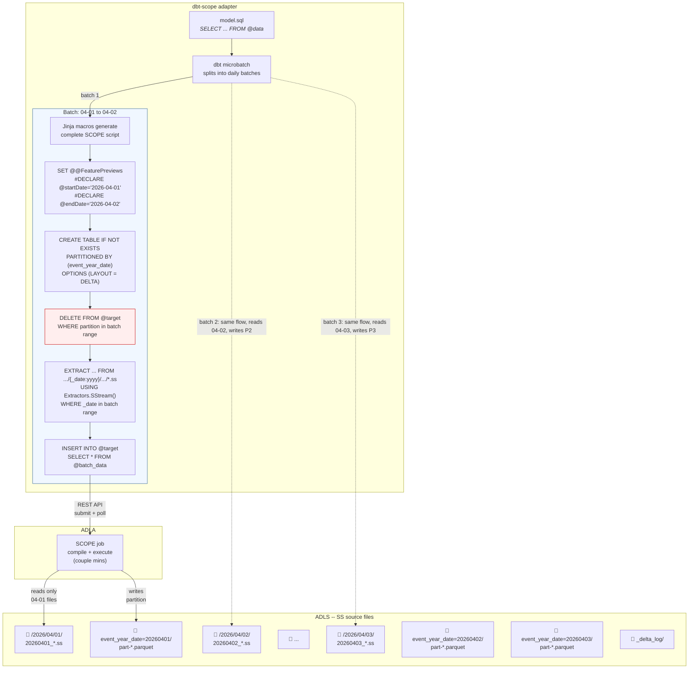

<!-- PROJECT LOGO -->
<p align="center">
  
  <h3 align="center">ADLA - dbt</h3>
  <p align="center">
    Incremental data transformation for ADLA using dbt.
    <br />
    <br />
    <a href="https://docs.getdbt.com/">dbt Docs</a>
    ·
    <a href="https://azure.microsoft.com/en-us/products/data-lake-analytics">Azure Data Lake Analytics docs</a>
  </p>
</p>

---

- **Clean SQL models** — write `SELECT ... FROM @data`; macros generate `#DECLARE`, `EXTRACT`, `INSERT INTO`
- **Microbatch incremental** — `DELETE+INSERT` per date partition, with dbt retry/backfill built in. `DELETE` is optional if the target can handle deduplication 
- **Declarative table properties** — compression, checkpoint intervals via `scope_settings`

## How it works

SS files live on ADLS in date-partitioned directories. `dbt run` computes which date batches need processing, generates a SCOPE script per batch, and submits each as an ADLA job. Each job reads only its date range (FileSet partition elimination), optionally deletes the target partition in Delta (for idempotent re-runs without duplicates), and inserts into a Delta table on ADLS.



On **full refresh**, all batches run and there is no `DELETE` step.
On **incremental**, dbt only runs batches after the last checkpoint (`MAX(event_time)` from the target). The `DELETE` (highlighted red) makes each batch idempotent — re-running the same batch replaces the partition.

## Install

```powershell
pip install -e ".[dev]"    # Python 3.10+, dbt-core ~1.9
```

## Configure

All sensitive values live in `.env` (see `.env.example`). The profile references them via `env_var()`:

```yaml
# profiles.yml
my_project:
  target: dev
  outputs:
    dev:
      type: scope
      database: "{{ env_var('SCOPE_STORAGE_ACCOUNT') }}"
      schema: "{{ env_var('SCOPE_CONTAINER') }}"
      adla_account: "{{ env_var('SCOPE_ADLA_ACCOUNT') }}"
      storage_account: "{{ env_var('SCOPE_STORAGE_ACCOUNT') }}"
      container: "{{ env_var('SCOPE_CONTAINER') }}"
      delta_base_path: delta
      au: 100
      priority: 1
```

| dbt concept   | SCOPE concept                                |
| ------------- | -------------------------------------------- |
| `database`    | Storage account name                         |
| `schema`      | ADLS container                               |
| `table`       | Full-refresh: `CREATE TABLE` + `INSERT INTO` |
| `incremental` | Microbatch: `DELETE` partition + `INSERT`    |
| model SQL     | `SELECT` from `@data` (extracted SS rowset)  |

## Usage

### Full refresh

```sql
{{ config(
    materialized='table',
    delta_location='abfss://ctr@acct.dfs.core.windows.net/delta/my_table',
    ss_source_path='/my/cosmos/path/to/MyStream',
    partition_by='event_year_date',
    scope_columns=[
        {'name': 'server_name', 'type': 'string'},
        {'name': 'event_year_date', 'type': 'string'}
    ],
    scope_settings={'microsoft.scope.compression': 'vorder:zstd#11'}
) }}

SELECT logical_server_name_DT_String AS server_name,
       _date.ToString("yyyyMMdd") AS event_year_date
FROM @data
```

### Incremental (microbatch)

```sql
{{ config(
    materialized='incremental',
    incremental_strategy='microbatch',
    event_time='event_year_date',
    batch_size='day',
    begin='2026-04-01',
    lookback=1,
    partition_by='event_year_date',
    delta_location='abfss://ctr@acct.dfs.core.windows.net/delta/my_model',
    ss_source_path='/my/cosmos/path/to/MyStream',
    scope_columns=[
        {'name': 'server_name', 'type': 'string'},
        {'name': 'event_year_date', 'type': 'string'}
    ]
) }}

SELECT logical_server_name_DT_String AS server_name,
       _date.ToString("yyyyMMdd") AS event_year_date
FROM @data
```

`dbt retry` re-runs failed batches. `dbt run --event-time-start/end` backfills a range.

## Contributing

See [CONTRIBUTING.md](CONTRIBUTING.md).
